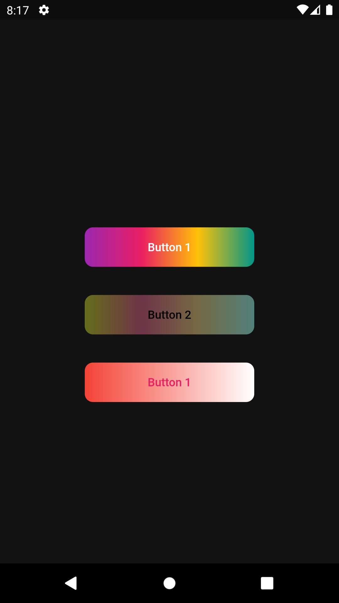
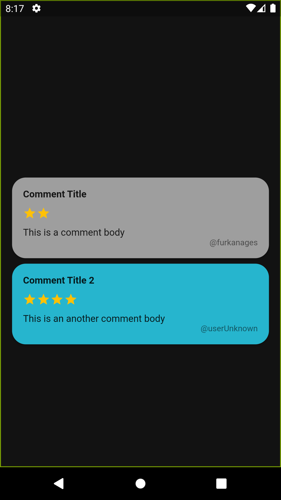
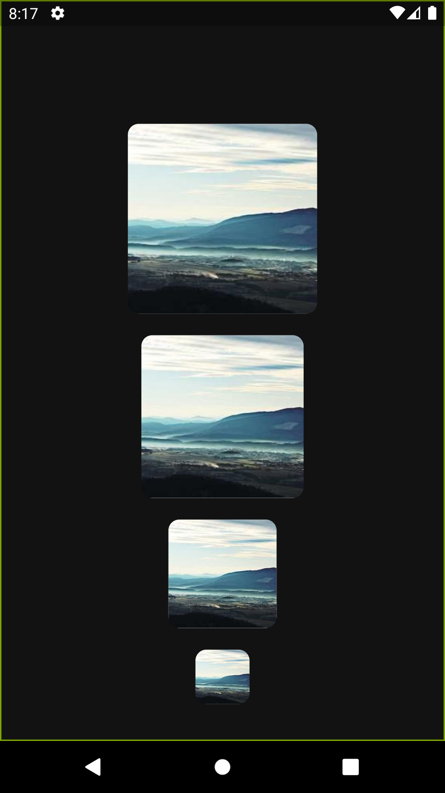
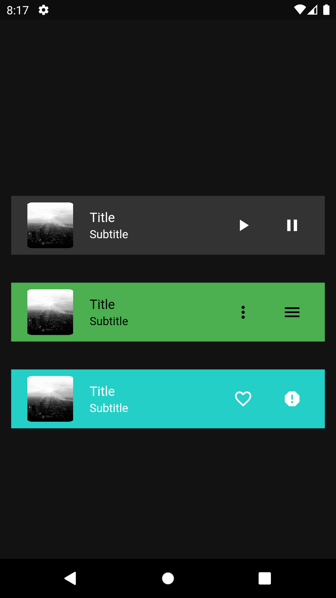
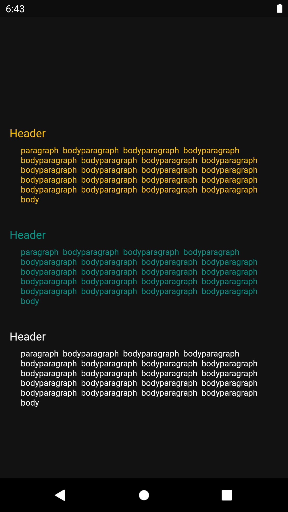
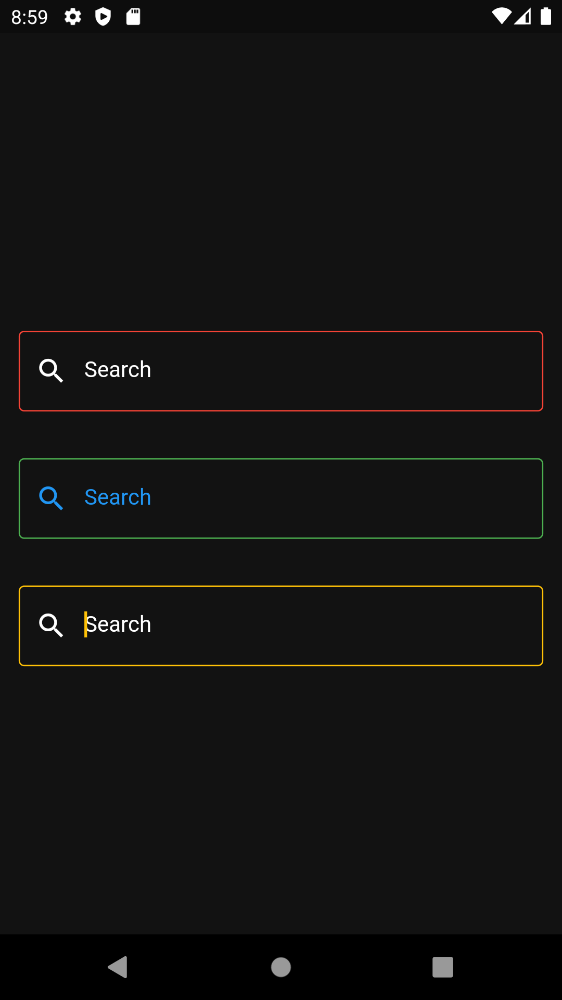
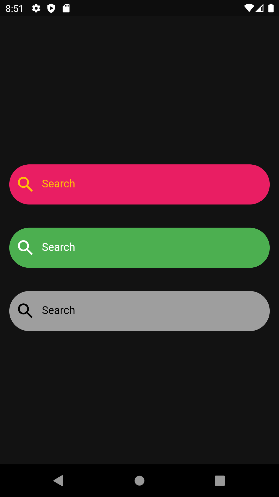
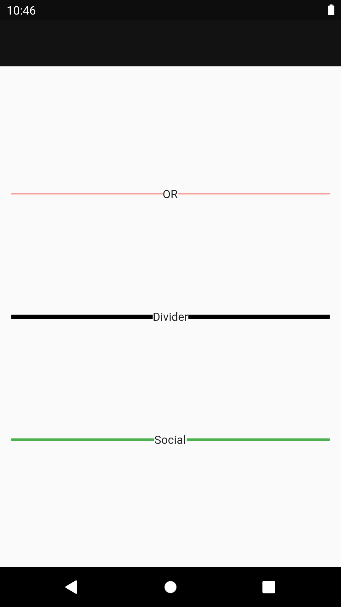

# Custom Flutter Widgets
- I brought together the custom widgets that I used in my own flutter projects in this repository.
- You can add the widget you want to your project and use it, and you can change its features.

## Custom Container Widgets
<table>
  <tr>
    <td>Bordered Icon-Text Container</td>
    <td>Container with Text</td>
    <td>Gradient Text Container</td> 
  </tr>  
  <tr>
    <td></td>
    <td></td>
     <td></td>
  </tr>
</table>
<table>
  <tr>
  <td>Scrollable Paragrapgh Container</td> 
    <td>Shadowed Container</td> 
  </tr>  
  <tr>
   <td></td>
    <td></td>
  </tr>
</table>

## Custom ElevatedButton Widgets
<table>
  <tr>
    <td>Gradient ElevatedButton</td>
  </tr>  
  <tr>
    <td></td>
  </tr>
</table>

## Custom Card Widgets
<table>
  <tr>
    <td>Comment Card</td>
        <td>Square Image Card</td>
  </tr>  
  <tr>
    <td></td>
      <td></td>
  </tr>
</table>

## Custom Listtile Widgets
<table>
  <tr>
    <td>Music Info Listtile</td>
        
  </tr>  
  <tr>
    <td></td>

  </tr>
</table>

## Custom Text Widgets
<table>
  <tr>
    <td>Title-Paragraph Text</td>
         <td>Clickable Texts Row </td>
  </tr>  
  <tr>
    <td></td>
   <td></td>
  </tr>
</table>

## Custom Textfield Widgets
<table>
  <tr>
    <td>Search Bar</td>
          <td>Long Textfield</td>
      <td>Stadium Search Bar</td>
  </tr>  
  <tr>
    <td></td>
  <td></td>
      <td></td>
  </tr>
</table>

## Divider Widgets
<table>
  <tr>
    <td>Divider with Text</td>
  
  </tr>  
  <tr>
    <td></td>

  </tr>
</table>
